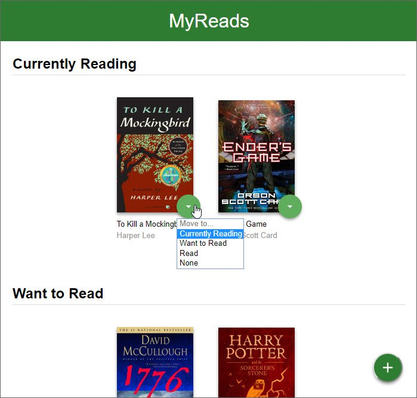

# MyReads

MyReads is a simple cataloging app that allows you to place books in one of three shelves or categories.

- Currently Reading
- Want to Read
- Read

It also allow you to search for books based on title and author.

You can see [screenshots](#screenshots) below.

## Usage

The project can be run with

- `npm start`

The project can be viewed in the browser at

- [http://localhost:3000](http://localhost:3000)

## Screenshots

